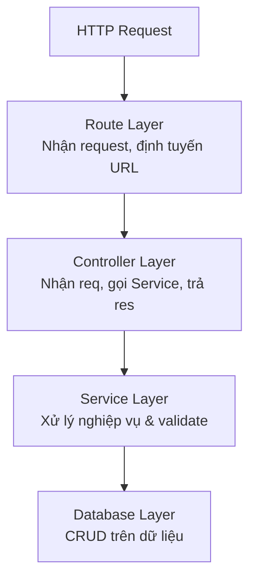
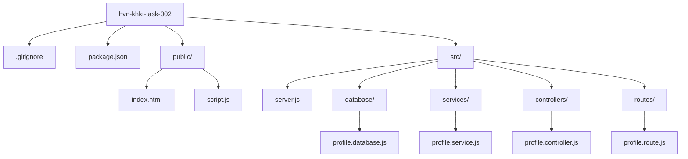
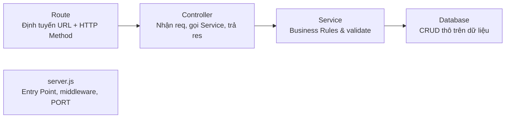
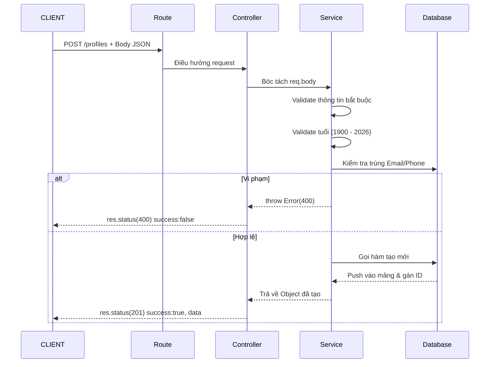
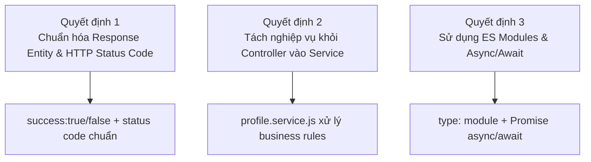
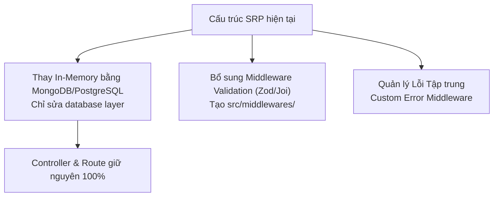

# Trực quan hóa: Báo cáo Phân tích Quyết định Kiến trúc & Cấu trúc Thư mục

> Dự án: **hvn-khkt-task-002** (API Quản lý Thông tin Cá nhân)
> Mục tiêu: Hệ thống RESTful API chuẩn hóa, tuân thủ SRP và mô hình Layered Architecture / MVC.

---

## 1. Kiến trúc phân tầng (Layered Architecture)

Hệ thống chia thành 4 tầng riêng biệt, luồng dữ liệu đi một chiều từ ngoài vào trong.

---

## 2. Cấu trúc thư mục (Folder Structure)

---

## 3. Ranh giới trách nhiệm từng tầng (Boundaries)

---

## 4. Luồng dữ liệu: Tạo Profile mới (POST /profiles)

---

## 5. Ma trận quyết định kiến trúc (ADR)

---

## 6. Định hướng nâng cấp & mở rộng (Scalability Roadmap)

