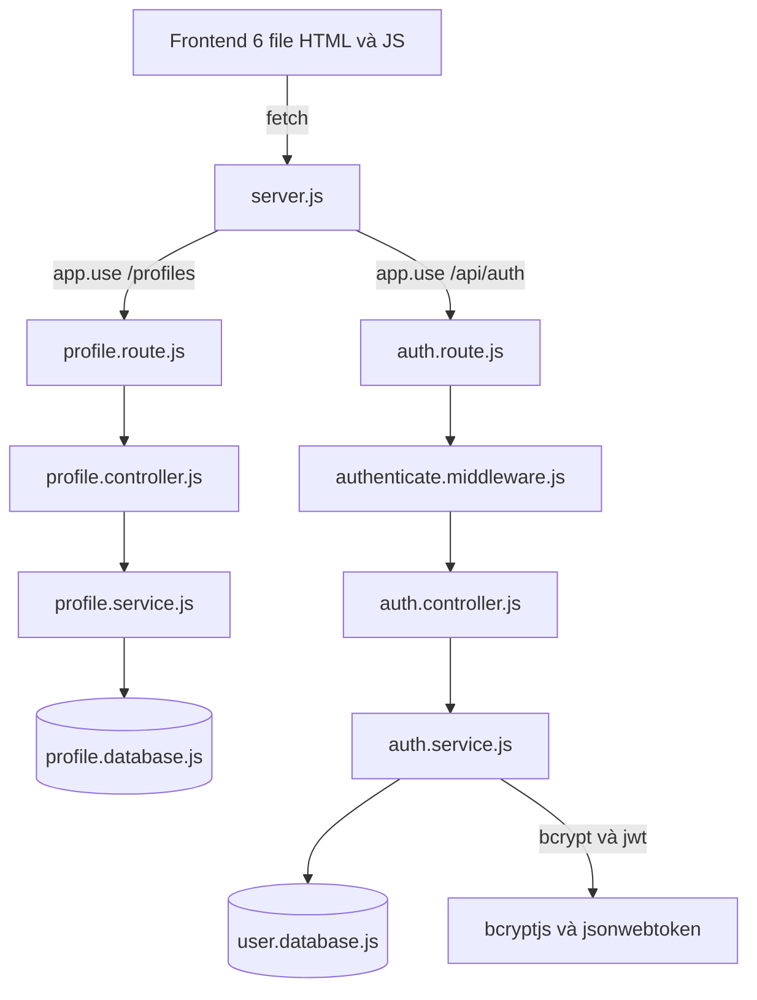
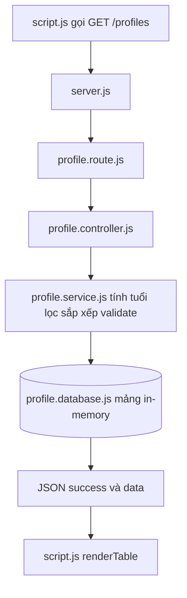
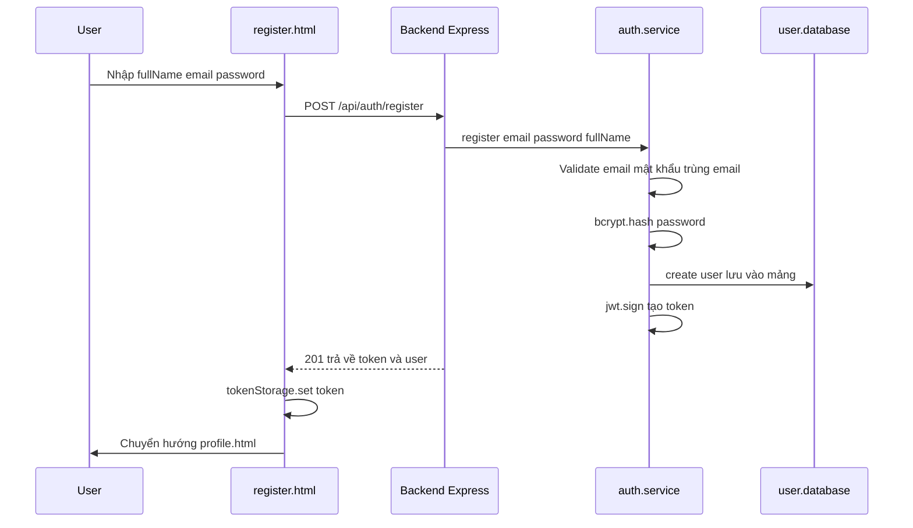
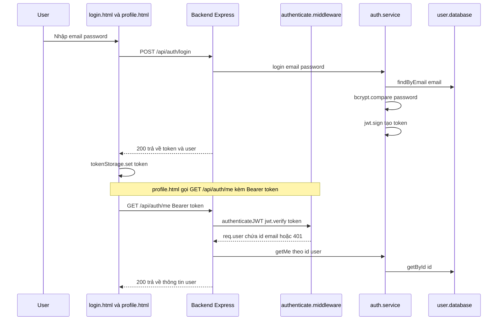

# **Hướng Dẫn Hiểu Dự Án TrueProject — Cẩm Nang Toàn Diện**

> Cẩm nang này giúp bạn đọc hiểu toàn bộ dự án **trueproject** — một ứng dụng web **Quản lý Thông tin Cá nhân (CRUD)** kèm **hệ thống Đăng ký / Đăng nhập xác thực bằng JWT**, được xây dựng bằng **Node.js + Express 5** (backend) và **HTML/CSS/JS thuần** (frontend).
>
> Tài liệu được soạn theo phương pháp học từ `docs_helpful/learningguide.md`: đi từ **phương pháp đọc code** → **tổng quan kiến trúc** → **luồng hoạt động** → **đọc từng file từng dòng** → **bài tập thực hành**.

---

## 📑 Mục lục

1. [Phương pháp đọc code JavaScript](#1-phương-pháp-đọc-code-javascript)
2. [Tổng quan dự án](#2-tổng-quan-dự-án)
3. [Cách chạy dự án](#3-cách-chạy-dự-án)
4. [Luồng hoạt động](#4-luồng-hoạt-động)
5. [Đọc từng file: Backend](#5-đọc-từng-file-backend)
6. [Đọc từng file: Frontend](#6-đọc-từng-file-frontend)
7. [Bảng tổng kết liên kết giữa các file](#7-bảng-tổng-kết-liên-kết-giữa-các-file)
8. [Bài tập thực hành & lời khuyên](#8-bài-tập-thực-hành--lời-khuyên)

---

# 1. Phương pháp đọc code JavaScript

Trước khi đọc dự án, hãy nắm **phương pháp** đọc file JS để không bị "rối mắt". Phần này tóm tắt từ `docs_helpful/learningguide.md`.

## 1.1 Ba "bẫy tâm lý" cần tránh

1. **Thấy cú pháp lạ là hoảng:** JS có nhiều cách viết ngắn (Arrow function, Destructuring, Optional Chaining...). Bạn không cần nhớ hết — chỉ cần **nhận diện dạng** của nó (xem bảng ở mục 1.3).
2. **Đọc thẳng từ dòng 1 đến hết file:** Trong JS, hàm có thể được khai báo phía trên nhưng **chỉ chạy khi có sự kiện** (click chuột, submit form, tải trang...). Điểm khởi đầu thường nằm ở **cuối file** (các `addEventListener` hoặc lời gọi hàm).
3. **Cố hiểu tất cả thư viện bên ngoài:** Các dòng `import` ở đầu file chỉ là "mượn công cụ". Hãy tập trung vào **logic do người viết code tạo ra**.

## 1.2 Quy trình 5 bước đọc một file JS

| Bước | Việc cần làm |
|------|--------------|
| **1. Xác định môi trường & vai trò** | Nhìn tên + vị trí file. `server.js` = entry point; thư mục `routes/`, `controllers/`, `services/`, `database/`, `middlewares/` = mỗi tầng một việc. |
| **2. Tách cấu trúc 4 phần** | Import (nạp công cụ) → Khai báo biến/cấu hình → Khai báo hàm → Thực thi/Export. |
| **3. Giải mã cú pháp hiện đại** | Tra bảng 1.3 nếu gặp cú pháp lạ. |
| **4. Đọc theo luồng dữ liệu** | Tìm **trigger** (sự kiện/lời gọi), đi theo dữ liệu: vào từ đâu → biến đổi qua hàm nào → kết quả đi đâu. |
| **5. Thực hành** | Tự đọc một luồng chức năng hoàn chỉnh (xem Phần 8). |

**Cấu trúc 4 phần của một file JS chuẩn:**

```
┌─────────────────────────────────────────┐
│ 1. Import / Require (nạp công cụ)        │
├─────────────────────────────────────────┤
│ 2. Khai báo biến / Cấu hình toàn cục      │
├─────────────────────────────────────────┤
│ 3. Khai báo các Hàm (Functions/Classes) │
├─────────────────────────────────────────┤
│ 4. Thực thi / Export (xuất ra ngoài)     │
└─────────────────────────────────────────┘
```

## 1.3 Bảng giải mã cú pháp JS hiện đại (ví dụ lấy từ chính dự án)

| Cú pháp bạn thấy | Dạng truyền thống | Ý nghĩa | Ví dụ trong dự án |
|------------------|-------------------|---------|-------------------|
| `const ok = (data) => ({...})` | `function ok(data) { return {...}; }` | **Arrow Function** — hàm mũi tên; dấu ngoặc `()` quanh object để trả object trực tiếp | `profile.service.js` |
| `const { email } = req.body` | `const email = req.body.email` | **Destructuring** — bóc tách thuộc tính từ object | `auth.service.js` |
| `\`Bearer ${token}\`` | `"Bearer " + token` | **Template Literal** — ghép chuỗi bằng backtick | `auth.js`, `script.js` |
| `{ ...p, age: 2026 - p.birthYear }` | gán thủ công từng thuộc tính | **Spread operator** — copy object và thêm/sửa thuộc tính | `profile.service.js` |
| `data?.user?.name` | `data && data.user && data.user.name` | **Optional Chaining** — an toàn khi dữ liệu thiếu | (dùng trong dự án ở các object `result?.data`) |
| `async/await` | chuỗi `.then()` | **Bất đồng bộ** — chờ lời gọi API/DB xong rồi chạy tiếp | toàn bộ backend |
| `req.params.id`, `req.query` | — | Lấy tham số từ URL: `/profiles/5` → `params.id = 5`; `?search=a` → `query.search = 'a'` | `profile.controller.js` |

---

# 2. Tổng quan dự án

## 2.1 Dự án này là gì?

Dự án **trueproject** gồm **2 khối chức năng**:

1. **Khối CRUD Quản lý Thông tin Cá nhân** (`/profiles`) — công khai (không cần đăng nhập), quản lý danh sách hồ sơ: xem, thêm, sửa, xóa, lọc, sắp xếp.
2. **Khối Xác thực (Auth)** (`/api/auth`) — đăng ký, đăng nhập, xem thông tin cá nhân bằng **JWT**; trang `profile.html` yêu cầu đăng nhập.

Cả hai khối đều tuân theo **kiến trúc 4 tầng (SRP)**:
`Route → Controller → Service → Database`.

## 2.2 Cây thư mục đầy đủ (17 file chính)

```
trueproject/
├── .gitignore                        (chặn node_modules/, .env, logs/)
├── backend/                          ← MÁY CHỦ API (Node.js + Express 5)
│   ├── package.json                  (khai báo "type":"module", scripts, dependencies)
│   ├── .env                          (PORT, JWT_SECRET — KHÔNG commit)
│   └── src/
│       ├── server.js                 (Điểm khởi động — nối mọi thứ)
│       ├── routes/
│       │   ├── profile.route.js      (bản đồ URL /profiles)
│       │   └── auth.route.js         (bản đồ URL /api/auth)
│       ├── controllers/
│       │   ├── profile.controller.js (điều phối request profiles)
│       │   └── auth.controller.js    (điều phối request auth)
│       ├── services/
│       │   ├── profile.service.js    (nghiệp vụ CRUD profiles)
│       │   └── auth.service.js       (nghiệp vụ đăng ký/đăng nhập/JWT)
│       ├── database/
│       │   ├── profile.database.js   (kho lưu trữ in-memory profiles)
│       │   └── user.database.js      (kho lưu trữ in-memory users)
│       └── middlewares/
│           ├── error.middleware.js       (bắt lỗi toàn cục)
│           └── authenticate.middleware.js (xác thực JWT)
└── frontend/                         ← GIAO DIỆN (HTML/CSS/JS thuần)
    ├── index.html                    (trang quản lý profiles cũ)
    ├── script.js                     (logic gọi /profiles)
    ├── login.html                    (trang đăng nhập)
    ├── register.html                 (trang đăng ký)
    ├── profile.html                  (trang cá nhân — cần đăng nhập)
    └── auth.js                       (helper dùng chung: token, guard, apiFetch)
```

## 2.3 Công nghệ sử dụng

| Công nghệ | Vai trò | Ghi chú |
|-----------|---------|---------|
| **Node.js + Express 5** | Tạo máy chủ HTTP + API | Dùng ES Modules (`"type": "module"` → `import/export`) |
| **cors** | Cho phép trình duyệt gọi API | `app.use(cors())` |
| **dotenv** | Đọc biến môi trường từ `.env` | `import 'dotenv/config'` |
| **bcryptjs** | Băm (hash) mật khẩu | Thuần JS, không lộ mật khẩu gốc |
| **jsonwebtoken** | Phát & kiểm tra JWT | Token sống `1h` |
| **Vanilla JS** | Frontend: `fetch()` gọi API | Không framework, không bundler |

## 2.4 Khái niệm cần biết trước khi đọc phần auth

- **JWT (JSON Web Token):** một chuỗi token dạng `xxx.yyy.zzz` chứa 3 phần (header, payload, signature). Backend ký token bằng `JWT_SECRET`; token chứa `sub` (id user), `email`, thời gian hết hạn `exp`.
- **Bearer Token:** cách gửi token qua HTTP — header `Authorization: Bearer <token>`.
- **localStorage:** bộ nhớ của trình duyệt; frontend lưu token vào đây để gửi lại ở các request sau.
- **Hash mật khẩu (bcrypt):** biến mật khẩu gốc thành chuỗi ngẫu nhiên một chiều. Không bao giờ lưu mật khẩu gốc.
- **Auto-login:** khi đăng ký/đăng nhập thành công, backend trả token; frontend lưu token và vào thẳng trang profile (không cần đăng nhập lại).

## 2.5 Sơ đồ kiến trúc tổng thể



---

# 3. Cách chạy dự án

## 3.1 Các lệnh quan trọng

Mở terminal **tại thư mục `backend/`** rồi chạy:

```bash
npm install        # Lần đầu: cài các thư viện (express, cors, dotenv, bcryptjs, jsonwebtoken)
npm start          # Chạy server: node src/server.js
npm run dev        # Chế độ phát triển: node --watch src/server.js (tự khởi động lại khi sửa file)
```

Sau khi chạy, mở trình duyệt tại **http://localhost:3000**.

## 3.2 Vai trò file `.env`

File `backend/.env` chứa biến môi trường:

```
PORT=3000
JWT_SECRET=c9f03cb8... (chuỗi bí mật dài)
```

- `PORT` → số cổng server (Express đọc qua `process.env.PORT`).
- `JWT_SECRET` → "chìa khóa" dùng để **ký và xác minh token**. Mọi file dùng JWT đều đọc `process.env.JWT_SECRET`.
- `server.js` nạp `.env` ngay từ dòng đầu bằng `import 'dotenv/config'`.
- ⚠️ **Quy tắc:** `.env` nằm trong `.gitignore` → **không bao giờ commit**. Nếu đổi `JWT_SECRET`, mọi token cũ sẽ **hết hạn ngay lập tức**.

## 3.3 Kiểm tra server sống

Mở `http://localhost:3000/ping` → nhận:
```json
{ "success": true, "message": "pong" }
```
Endpoint `/ping` nằm trong `server.js` (dòng `app.get('/ping', ...)`) — dùng để kiểm tra server có chạy hay không.

---

# 4. Luồng hoạt động

Đây là phần quan trọng nhất để hiểu dự án. Dữ liệu luôn chạy theo **một chiều duy nhất**: Frontend → Route → Controller → Service → Database → trả về Frontend.

## 4.1 Luồng CRUD profiles (không cần đăng nhập)



## 4.2 Luồng Đăng ký (auto-login)



## 4.3 Luồng Đăng nhập + Truy cập trang profile (JWT)



> 💡 **Tóm tắt:** Route `/profiles` KHÔNG yêu cầu đăng nhập (công khai). Route `/api/auth/me` YÊU CẦU token hợp lệ — nếu thiếu/sai/hết hạn → trả `401` và chặn.

---

# 5. Đọc từng file: Backend

> **Mẹo chung:** Đọc backend theo thứ tự `server.js` → `routes` → `controllers` → `services` → `database` → `middlewares`. Mỗi tầng chỉ làm **một việc** (SRP):
> 1. **Route** — biết "đường đi" (URL nào gọi hàm nào).
> 2. **Controller** — nhận `req`, gọi Service, trả `res` + mã HTTP.
> 3. **Service** — chứa nghiệp vụ (validate, tính tuổi, lọc, hash, JWT).
> 4. **Database** — CRUD thô trên mảng in-memory.
> 5. **Middleware** — chặn giữa đường (xác thực, bắt lỗi).

## 5.1 `backend/src/server.js` — Điểm khởi động (nối mọi thứ)

```javascript
import 'dotenv/config'; // 🔐 NẠP BIẾN MÔI TRƯỜNG TỪ .env — đặt ngay đầu file
import express from 'express';
import cors from 'cors';
import { fileURLToPath } from 'url';
import path from 'path';
import profileRoutes from './routes/profile.route.js';
import authRoutes from './routes/auth.route.js'; // 🔐 IMPORT ROUTE AUTH
import errorHandler from './middlewares/error.middleware.js';

const app = express();
const PORT = process.env.PORT || 3000;

// Lấy __dirname trong ES Module
const __filename = fileURLToPath(import.meta.url);
const __dirname = path.dirname(__filename);

// Global middleware
app.use(cors());
app.use(express.json());

// Serve frontend (nằm ngoài backend/)
app.use(express.static(path.join(__dirname, '../../frontend')));

// Endpoint test
app.get('/ping', (req, res) => {
  res.json({ success: true, message: 'pong' });
});

// Mount routes
app.use('/profiles', profileRoutes);        // giữ nguyên
app.use('/api/auth', authRoutes);           // 🔐 MOUNT ROUTE AUTH MỚI

// Global error handler (PHẢI đặt cuối cùng)
app.use(errorHandler);

app.listen(PORT, () => {
  console.log(`Server running at http://localhost:${PORT}`);
});
```

**Giải thích từng dòng quan trọng:**

| Dòng | Chức năng |
|------|-----------|
| `import 'dotenv/config'` | Đọc `.env` → nạp `PORT`, `JWT_SECRET` vào `process.env`. Đặt **đầu tiên** để các file sau thấy biến. |
| `import express from 'express'` | Mượn thư viện Express để tạo server. |
| `fileURLToPath` + `path` | Trong ES Module không có sẵn `__dirname`; 2 dòng này tự tính đường dẫn thư mục hiện tại (dùng cho `express.static`). |
| `app.use(cors())` | Bật CORS — cho phép trình duyệt gọi API. |
| `app.use(express.json())` | Tự đọc body JSON từ request (`req.body`). |
| `app.use(express.static(...))` | Phục vụ các file frontend. Đường `'../../frontend'` từ `backend/src/` đi lên 2 cấp ra `frontend/`. |
| `app.get('/ping', ...)` | Endpoint kiểm tra sức khỏe. |
| `app.use('/profiles', profileRoutes)` | **Liên kết quan trọng #1:** mọi URL bắt đầu `/profiles` chuyển sang `profile.route.js`. |
| `app.use('/api/auth', authRoutes)` | **Liên kết quan trọng #2:** mọi URL bắt đầu `/api/auth` chuyển sang `auth.route.js`. |
| `app.use(errorHandler)` | Bộ bắt lỗi toàn cục — **PHẢI đặt cuối cùng** sau tất cả route. |
| `app.listen(PORT, ...)` | Bắt đầu lắng nghe trên cổng 3000. |

## 5.2 `backend/src/routes/profile.route.js` — Bản đồ đường đi /profiles

```javascript
import { Router } from 'express';
import { profileController } from '../controllers/profile.controller.js';

const router = Router();

router.get('/', profileController.getAll);
router.get('/:id', profileController.getById);
router.post('/', profileController.create);
router.put('/:id', profileController.update);
router.patch('/:id', profileController.patch);
router.delete('/:id', profileController.delete);

export default router;
```

**Giải thích:**
- `Router()` tạo bộ định tuyến con, sau đó `export default` để `server.js` gắn vào `app.use('/profiles', router)`.
- `router.get('/', ...)` → khi có `GET /profiles`, gọi hàm `getAll`.
- `:id` là **tham số động** — `/profiles/5` thì `req.params.id = 5`.
- File này **không chứa logic** — chỉ nối URL với Controller.

## 5.3 `backend/src/routes/auth.route.js` — Bản đồ đường đi /api/auth

```javascript
import { Router } from 'express';
import { authController } from '../controllers/auth.controller.js';
import authenticateJWT from '../middlewares/authenticate.middleware.js';

const router = Router();

// Công khai (public)
router.post('/register', authController.register);
router.post('/login', authController.login);

// Bảo vệ (protected) — yêu cầu JWT hợp lệ
router.get('/me', authenticateJWT, authController.getMe);

export default router;
```

**Giải thích:**
- `POST /register`, `POST /login` → **công khai**, không cần token.
- `GET /me` → **được bảo vệ**: trước khi chạy `getMe`, request phải đi qua `authenticateJWT`. Đây chính là cơ chế "chỉ ai đã đăng nhập mới xem được thông tin của mình".
- Lưu ý thứ tự tham số: `router.get('/me', authenticateJWT, authController.getMe)` — middleware nằm giữa URL và handler.

## 5.4 `backend/src/controllers/profile.controller.js` — Người điều phối profiles

```javascript
import { profileService } from '../services/profile.service.js';

export const profileController = {
  async getAll(req, res, next) {
    try {
      const result = await profileService.getAllProfiles(req.query);
      if (!result.isSuccess) return res.status(result.statusCode).json({ success: false, message: result.message });
      res.status(200).json({ success: true, message: 'Lấy danh sách thành công', data: result.data });
    } catch (err) { next(err); }
  },

  async getById(req, res, next) {
    try {
      const result = await profileService.getById(Number(req.params.id));
      if (!result.isSuccess) return res.status(result.statusCode).json({ success: false, message: result.message });
      res.status(200).json({ success: true, message: 'Lấy profile thành công', data: result.data });
    } catch (err) { next(err); }
  },

  async create(req, res, next) {
    try {
      const result = await profileService.createProfile(req.body);
      if (!result.isSuccess) return res.status(result.statusCode).json({ success: false, message: result.message });
      res.status(201).json({ success: true, message: 'Tạo profile thành công', data: result.data });
    } catch (err) { next(err); }
  },

  async update(req, res, next) {
    try {
      const result = await profileService.update(Number(req.params.id), req.body);
      if (!result.isSuccess) return res.status(result.statusCode).json({ success: false, message: result.message });
      res.status(200).json({ success: true, message: 'Cập nhật thành công', data: result.data });
    } catch (err) { next(err); }
  },

  async patch(req, res, next) {
    try {
      const result = await profileService.patch(Number(req.params.id), req.body);
      if (!result.isSuccess) return res.status(result.statusCode).json({ success: false, message: result.message });
      res.status(200).json({ success: true, message: 'Cập nhật một phần thành công', data: result.data });
    } catch (err) { next(err); }
  },

  async delete(req, res, next) {
    try {
      const result = await profileService.delete(Number(req.params.id));
      if (!result.isSuccess) return res.status(result.statusCode).json({ success: false, message: result.message });
      res.status(204).send(); // 204 KHÔNG có body
    } catch (err) { next(err); }
  }
};
```

**Giải thích (lấy `getAll` làm mẫu, 5 handler còn lại giống cấu trúc):**
- `req` = yêu cầu (chứa `query`, `params`, `body`); `res` = phản hồi; `next` = chuyển lỗi xuống middleware.
- `await profileService.getAllProfiles(req.query)` → **liên kết sang Service**. `req.query` chứa `?search=...&gender=...`.
- **Result Object Pattern:** Service trả về `{ isSuccess: true, data }` hoặc `{ isSuccess: false, statusCode, message }`.
  - Nếu `isSuccess = false` → trả `res.status(statusCode).json({success:false, message})`.
  - Nếu thành công → trả `200` kèm `data`.
- `Number(req.params.id)` → chuyển `"5"` (string từ URL) thành số `5` để so sánh đúng kiểu.
- `res.status(204).send()` → DELETE thành công trả **204 No Content** (không có body).
- `catch (err) { next(err); }` → lỗi bất ngờ chuyển xuống `errorHandler`.

## 5.5 `backend/src/controllers/auth.controller.js` — Người điều phối auth

```javascript
import { authService } from '../services/auth.service.js';

export const authController = {
  // POST /api/auth/register
  async register(req, res, next) {
    try {
      const result = await authService.register(req.body);
      if (!result.isSuccess) {
        return res.status(result.statusCode).json({ success: false, message: result.message });
      }
      res.status(201).json({ success: true, message: 'Đăng ký thành công', data: result.data });
    } catch (err) { next(err); }
  },

  // POST /api/auth/login
  async login(req, res, next) {
    try {
      const result = await authService.login(req.body);
      if (!result.isSuccess) {
        return res.status(result.statusCode).json({ success: false, message: result.message });
      }
      res.status(200).json({ success: true, message: 'Đăng nhập thành công', data: result.data });
    } catch (err) { next(err); }
  },

  // GET /api/auth/me  (protected — cần token hợp lệ)
  async getMe(req, res, next) {
    try {
      const result = await authService.getMe(req.user.id);
      if (!result.isSuccess) {
        return res.status(result.statusCode).json({ success: false, message: result.message });
      }
      res.status(200).json({ success: true, message: 'Lấy thông tin thành công', data: result.data });
    } catch (err) { next(err); }
  }
};
```

**Giải thích:**
- `register` → gọi `authService.register(req.body)`, thành công trả **201 Created**.
- `login` → gọi `authService.login(req.body)`, thành công trả **200 OK**.
- `getMe` → **dùng `req.user.id`** — giá trị này do middleware `authenticateJWT` gắn vào khi verify token thành công. Controller KHÔNG tự đọc token.

## 5.6 `backend/src/services/profile.service.js` — Bộ não nghiệp vụ profiles

```javascript
import { profileDb } from '../database/profile.database.js';

const CURRENT_YEAR = new Date().getFullYear();

// Result Object Pattern
const ok = (data) => ({ isSuccess: true, data });
const fail = (statusCode, message) => ({ isSuccess: false, statusCode, message });

export const profileService = {
  async getAllProfiles(queryParams = {}) {
    let list = await profileDb.getAll();

    // Tự tính tuổi
    list = list.map((p) => ({ ...p, age: CURRENT_YEAR - p.birthYear }));

    // Lọc theo tên
    if (queryParams.search) {
      const keyword = queryParams.search.toLowerCase();
      list = list.filter((p) => p.fullName.toLowerCase().includes(keyword));
    }

    // Lọc theo giới tính
    if (queryParams.gender) {
      list = list.filter((p) => p.gender === queryParams.gender);
    }

    // Sắp xếp theo năm sinh
    if (queryParams.sortBirthYear === 'asc') {
      list.sort((a, b) => a.birthYear - b.birthYear);
    } else if (queryParams.sortBirthYear === 'desc') {
      list.sort((a, b) => b.birthYear - a.birthYear);
    }

    return ok(list);
  },

  async getById(id) {
    const profile = await profileDb.getById(id);
    if (!profile) return fail(404, 'Không tìm thấy profile');
    return ok({ ...profile, age: CURRENT_YEAR - profile.birthYear });
  },

  async createProfile(data) {
    const required = ['fullName', 'birthYear', 'gender', 'email', 'phone'];
    for (const field of required) {
      if (data[field] === undefined || data[field] === null || data[field] === '') {
        return fail(400, `Thiếu trường bắt buộc: ${field}`);
      }
    }

    const birthYear = Number(data.birthYear);
    if (!Number.isInteger(birthYear) || birthYear < 1900 || birthYear > CURRENT_YEAR) {
      return fail(400, `Năm sinh phải từ 1900 - ${CURRENT_YEAR}`);
    }

    const duplicate = await profileDb.findByEmailOrPhone(data.email, data.phone);
    if (duplicate) return fail(400, 'Email hoặc số điện thoại đã tồn tại');

    const created = await profileDb.create(data);
    return ok(created);
  },

  async update(id, data) {
    const existing = await profileDb.getById(id);
    if (!existing) return fail(404, 'Không tìm thấy profile');

    // Strict PUT: bắt buộc đủ 5 trường
    const required = ['fullName', 'birthYear', 'gender', 'email', 'phone'];
    for (const field of required) {
      if (data[field] === undefined || data[field] === null || data[field] === '') {
        return fail(400, `Thiếu trường bắt buộc: ${field}`);
      }
    }

    const birthYear = Number(data.birthYear);
    if (!Number.isInteger(birthYear) || birthYear < 1900 || birthYear > CURRENT_YEAR) {
      return fail(400, `Năm sinh phải từ 1900 - ${CURRENT_YEAR}`);
    }

    const duplicate = await profileDb.findByEmailOrPhone(data.email, data.phone, id);
    if (duplicate) return fail(400, 'Email hoặc số điện thoại đã tồn tại');

    const updated = await profileDb.update(id, data);
    return ok(updated);
  },

  async patch(id, data) {
    const existing = await profileDb.getById(id);
    if (!existing) return fail(404, 'Không tìm thấy profile');

    if (data.birthYear !== undefined) {
      const birthYear = Number(data.birthYear);
      if (!Number.isInteger(birthYear) || birthYear < 1900 || birthYear > CURRENT_YEAR) {
        return fail(400, `Năm sinh phải từ 1900 - ${CURRENT_YEAR}`);
      }
    }

    if (data.email !== undefined || data.phone !== undefined) {
      const duplicate = await profileDb.findByEmailOrPhone(data.email, data.phone, id);
      if (duplicate) return fail(400, 'Email hoặc số điện thoại đã tồn tại');
    }

    const patched = await profileDb.patch(id, data);
    return ok(patched);
  },

  async delete(id) {
    const deleted = await profileDb.delete(id);
    if (!deleted) return fail(404, 'Không tìm thấy profile');
    return ok(true);
  }
};
```

**Giải thích từng hàm:**
- `ok(data)` / `fail(statusCode, message)` → hai hàm đóng gói kết quả theo **Result Object Pattern** `{isSuccess, data}` hoặc `{isSuccess:false, statusCode, message}`. Controller chỉ cần kiểm tra `isSuccess`.
- `getAllProfiles(queryParams)`:
  - `await profileDb.getAll()` → lấy mảng thô từ Database.
  - `.map((p) => ({ ...p, age: CURRENT_YEAR - p.birthYear }))` → **tự tính tuổi** cho từng profile (spread `...p` giữ nguyên dữ liệu cũ, thêm `age`).
  - `.filter()` theo `search` (tên, không phân biệt hoa thường nhờ `toLowerCase()`), theo `gender`.
  - `.sort()` theo `birthYear` tăng (`asc`) hoặc giảm (`desc`).
- `createProfile(data)`:
  - Kiểm tra **đủ 5 trường bắt buộc** → thiếu thì `fail(400)`.
  - Validate **năm sinh** trong khoảng `1900 → hiện tại`.
  - Kiểm tra **trùng email/phone** bằng `findByEmailOrPhone`.
  - Hợp lệ thì `profileDb.create(data)`.
- `update(id, data)` → **Strict PUT**: bắt buộc đủ cả 5 trường (khác PATCH), truyền `id` vào `findByEmailOrPhone` làm `excludeId` để không tự trùng chính mình.
- `patch(id, data)` → chỉ validate những trường **được gửi lên** (`!== undefined`), cho phép cập nhật một phần.
- `delete(id)` → xóa; nếu không tìm thấy trả `404`.

## 5.7 `backend/src/services/auth.service.js` — Bộ não nghiệp vụ auth (băm mật khẩu + phát JWT)

```javascript
import bcrypt from 'bcryptjs';
import jwt from 'jsonwebtoken';
import { userDb } from '../database/user.database.js';

// Result Object Pattern (giống profile.service.js)
const ok = (data) => ({ isSuccess: true, data });
const fail = (statusCode, message) => ({ isSuccess: false, statusCode, message });

// Hằng số cấu hình — dễ chỉnh sửa
const SALT_ROUNDS = 10;
const TOKEN_EXPIRES_IN = '1h';
// Secret: ưu tiên từ .env; fallback chỉ dành cho dev (đổi ngay khi lên production)
const JWT_SECRET = process.env.JWT_SECRET || 'dev-secret-change-me';

// Hàm dọn user trước khi trả ra ngoài: TUYỆT ĐỐI không lộ passwordHash
const toSafeUser = (user) => ({
  id: user.id,
  email: user.email,
  fullName: user.fullName,
  createdAt: user.createdAt
});

// Hàm phát JWT — dùng chung cho register và login
const signToken = (user) =>
  jwt.sign(
    { sub: user.id, email: user.email }, // payload: sub = id user
    JWT_SECRET,
    { expiresIn: TOKEN_EXPIRES_IN }
  );

const EMAIL_REGEX = /^[^\s@]+@[^\s@]+\.[^\s@]+$/;

export const authService = {
  // ── ĐĂNG KÝ ─────────────────────────────────────────────
  async register({ email, password, fullName }) {
    // 1. Validate email
    if (!email || !EMAIL_REGEX.test(String(email).trim())) {
      return fail(400, 'Email không hợp lệ');
    }
    // 2. Validate password
    if (!password || String(password).length < 6) {
      return fail(400, 'Mật khẩu phải có ít nhất 6 ký tự');
    }
    // 3. Validate fullName
    if (!fullName || !String(fullName).trim()) {
      return fail(400, 'Thiếu trường bắt buộc: fullName');
    }

    // 4. Chuẩn hóa email
    const normalizedEmail = String(email).trim().toLowerCase();

    // 5. Kiểm tra trùng email
    const existing = await userDb.findByEmail(normalizedEmail);
    if (existing) return fail(409, 'Email đã được đăng ký');

    // 6. Hash password
    const passwordHash = await bcrypt.hash(String(password), SALT_ROUNDS);

    // 7. Lưu user
    const user = await userDb.create({
      email: normalizedEmail,
      passwordHash,
      fullName: String(fullName).trim(),
      createdAt: new Date().toISOString()
    });

    // 8. Phát token (auto-login) và trả về user an toàn
    const token = signToken(user);
    return ok({ token, user: toSafeUser(user) });
  },

  // ── ĐĂNG NHẬP ────────────────────────────────────────────
  async login({ email, password }) {
    // Không validate format ở đây — chỉ cần tìm + so sánh
    const normalizedEmail = String(email || '').trim().toLowerCase();
    const user = await userDb.findByEmail(normalizedEmail);

    // Thông điệp lỗi GIỐNG NHAU cho cả "email sai" và "mật khẩu sai"
    // để không lộ thông tin user có tồn tại hay không (chống user enumeration)
    if (!user) return fail(401, 'Email hoặc mật khẩu không đúng');

    const match = await bcrypt.compare(String(password || ''), user.passwordHash);
    if (!match) return fail(401, 'Email hoặc mật khẩu không đúng');

    const token = signToken(user);
    return ok({ token, user: toSafeUser(user) });
  },

  // ── LẤY THÔNG TIN USER HIỆN TẠI ─────────────────────────
  async getMe(userId) {
    const user = await userDb.getById(userId);
    if (!user) return fail(404, 'Không tìm thấy user');
    return ok(toSafeUser(user));
  }
};
```

**Giải thích từng dòng quan trọng:**
- `SALT_ROUNDS = 10` → độ phức tạp của bcrypt (càng cao càng khó bẻ khóa, nhưng chậm hơn).
- `TOKEN_EXPIRES_IN = '1h'` → token tự hết hạn sau 1 giờ.
- `JWT_SECRET = process.env.JWT_SECRET || 'dev-secret-change-me'` → đọc "chìa khóa" từ `.env`; fallback chỉ cho dev.
- `toSafeUser(user)` → **cắt bỏ `passwordHash`** trước khi trả ra ngoài — không bao giờ lộ mật khẩu đã băm.
- `signToken(user)` → `jwt.sign(payload, secret, {expiresIn})`. Payload `{ sub: user.id, email }` — `sub` là id user.
- `EMAIL_REGEX` → biểu thức chính quy kiểm tra email hợp lệ.
- `register({email, password, fullName})`:
  1. Validate email (regex), mật khẩu ≥ 6 ký tự, fullName không rỗng.
  2. Chuẩn hóa email: `trim().toLowerCase()` — tránh trùng lặp do hoa/thường.
  3. Kiểm tra trùng email → `409 Conflict`.
  4. `bcrypt.hash(password, 10)` → băm mật khẩu (không lưu bản gốc).
  5. `userDb.create({...})` → lưu user kèm `createdAt` (thời gian ISO).
  6. `signToken(user)` + `toSafeUser(user)` → **auto-login**: trả luôn token.
- `login({email, password})`:
  - Tìm user theo email (đã lowercase).
  - `bcrypt.compare(password, user.passwordHash)` → so sánh mật khẩu gốc với chuỗi băm.
  - ⚠️ **Thông điệp lỗi giống nhau** cho cả "email sai" lẫn "mật khẩu sai" (`Email hoặc mật khẩu không đúng`) → chống **user enumeration** (kẻ tấn công dò xem email có tồn tại không).
  - Đúng → phát token, trả `{ token, user }`.
- `getMe(userId)` → lấy user theo id từ token, trả bản an toàn.

## 5.8 `backend/src/database/profile.database.js` — Kho lưu trữ profiles

```javascript
// Tầng Database: chỉ CRUD thô trên mảng In-Memory, KHÔNG chứa nghiệp vụ.
let profiles = [
  { id: 1, fullName: 'Nguyễn Văn A', birthYear: 2000, gender: 'male', email: 'a@example.com', phone: '0901000001' },
  { id: 2, fullName: 'Trần Thị B', birthYear: 1995, gender: 'female', email: 'b@example.com', phone: '0901000002' }
];
let nextId = 3;

export const profileDb = {
  async getAll() {
    return [...profiles];
  },
  async getById(id) {
    return profiles.find((p) => p.id === id) || null;
  },
  async create(data) {
    const newProfile = { id: nextId++, ...data };
    profiles.push(newProfile);
    return newProfile;
  },
  async update(id, data) {
    const index = profiles.findIndex((p) => p.id === id);
    if (index === -1) return null;
    profiles[index] = { id, ...data };
    return profiles[index];
  },
  async patch(id, data) {
    const index = profiles.findIndex((p) => p.id === id);
    if (index === -1) return null;
    profiles[index] = { ...profiles[index], ...data, id };
    return profiles[index];
  },
  async delete(id) {
    const index = profiles.findIndex((p) => p.id === id);
    if (index === -1) return false;
    profiles.splice(index, 1);
    return true;
  },
  async findByEmailOrPhone(email, phone, excludeId) {
    return profiles.find(
      (p) => p.id !== excludeId && (p.email === email || p.phone === phone)
    ) || null;
  }
};
```

**Giải thích:**
- `profiles` là **mảng trong bộ nhớ** — có sẵn 2 bản ghi mẫu; dữ liệu sẽ **mất khi tắt server**.
- `nextId = 3` → id của bản ghi tiếp theo.
- `getAll()` → `[...profiles]` — spread tạo **bản sao** mảng, tránh lộ tham chiếu gốc.
- `getById(id)` → `.find()` tìm phần tử đầu tiên thỏa điều kiện, hoặc `null`.
- `create(data)` → tạo object mới với `id: nextId++` (tăng sau khi gán), rồi `push` vào mảng.
- `update(id, data)` → **PUT thay nguyên object**: `profiles[index] = { id, ...data }`.
- `patch(id, data)` → **PATCH gộp**: `{ ...profiles[index], ...data, id }` — giữ nguyên các trường không gửi.
- `delete(id)` → `.splice(index, 1)` xóa khỏi mảng; trả `true` nếu tìm thấy.
- `findByEmailOrPhone(email, phone, excludeId)` → tìm profile trùng email **hoặc** phone, loại trừ bản thân nó khi sửa (`excludeId`).

## 5.9 `backend/src/database/user.database.js` — Kho lưu trữ users

```javascript
// Tầng Database: chỉ CRUD thô trên mảng In-Memory, KHÔNG chứa nghiệp vụ.
// Nguyên tắc giống profile.database.js: không validate, không hash, không biết req/res.

let users = [];
let nextId = 1;

export const userDb = {
  async getAll() {
    return [...users];
  },

  async getById(id) {
    return users.find((u) => u.id === id) || null;
  },

  // Tìm user theo email (email đã được chuẩn hóa lowercase ở tầng Service)
  async findByEmail(email) {
    return users.find((u) => u.email === email) || null;
  },

  async create(data) {
    const newUser = { id: nextId++, ...data };
    users.push(newUser);
    return newUser;
  },

  async delete(id) {
    const index = users.findIndex((u) => u.id === id);
    if (index === -1) return false;
    users.splice(index, 1);
    return true;
  }
};
```

**Giải thích:**
- `users = []` → bắt đầu **rỗng** (không có user mẫu) — user đầu tiên phải tự đăng ký.
- `nextId = 1` → id bắt đầu từ 1.
- `findByEmail(email)` → tìm theo email (Service đã lowercase hóa trước khi gọi).
- Khác `profileDb` ở điểm: có `findByEmail` nhưng **không có** `update`/`patch` — auth không cần sửa user.

## 5.10 `backend/src/middlewares/error.middleware.js` — Bộ bắt lỗi toàn cục

```javascript
// Middleware bắt lỗi 4 tham số — phải đặt sau tất cả routes.
export default function errorHandler(err, req, res, next) {
  console.error(err);
  res.status(err.statusCode || 500).json({
    success: false,
    message: err.message || 'Lỗi máy chủ nội bộ'
  });
}
```

**Giải thích:**
- Hàm có **4 tham số** `(err, req, res, next)` — dấu hiệu nhận biết **middleware bắt lỗi** (Express phân biệt nhờ 4 tham số).
- `console.error(err)` → in lỗi ra terminal để debug.
- `res.status(err.statusCode || 500)` → trả mã lỗi nếu có, mặc định `500`.
- **PHẢI đặt sau tất cả routes** trong `server.js` — mọi lỗi từ Controller gọi `next(err)` sẽ rơi về đây.

## 5.11 `backend/src/middlewares/authenticate.middleware.js` — Lính gác JWT

```javascript
import jwt from 'jsonwebtoken';

const JWT_SECRET = process.env.JWT_SECRET || 'dev-secret-change-me';

// Middleware xác thực JWT — bảo vệ các route yêu cầu đăng nhập.
// Đặt TRƯỚC handler cần bảo vệ (vd: router.get('/me', authenticateJWT, handler)).
export default function authenticateJWT(req, res, next) {
  // 1. Đọc header Authorization
  const header = req.headers.authorization;
  if (!header || !header.startsWith('Bearer ')) {
    return res.status(401).json({ success: false, message: 'Thiếu token xác thực' });
  }

  // 2. Tách token (bỏ tiền tố "Bearer ")
  const token = header.slice(7).trim();

  // 3. Verify token
  try {
    const decoded = jwt.verify(token, JWT_SECRET);
    req.user = { id: decoded.sub, email: decoded.email }; // gắn user vào request
    return next();
  } catch (err) {
    // Phân biệt lỗi hết hạn vs lỗi khác
    const message =
      err.name === 'TokenExpiredError' ? 'Token đã hết hạn' : 'Token không hợp lệ';
    return res.status(401).json({ success: false, message });
  }
}
```

**Giải thích từng bước:**
1. **Đọc header:** Kiểm tra `Authorization` có tồn tại và bắt đầu bằng `"Bearer "`. Không có → `401 Thiếu token xác thực`.
2. **Tách token:** `header.slice(7)` — bỏ 7 ký tự đầu của `"Bearer "` để lấy chuỗi token, rồi `.trim()` bỏ khoảng trắng.
3. **Verify:** `jwt.verify(token, JWT_SECRET)` xác minh chữ ký + hạn dùng. Thành công → `decoded` chứa `sub` và `email` (payload lúc ký).
4. **Gắn user vào request:** `req.user = { id: decoded.sub, email: decoded.email }` → các handler phía sau dùng `req.user.id`.
5. **Xử lý lỗi:** phân biệt `TokenExpiredError` (hết hạn) với token sai. Cả hai đều trả `401`, không rơi vào error handler (tránh trả `500`).

---

# 6. Đọc từng file: Frontend

> **Mẹo chung:** Frontend gồm 6 file. `auth.js` là helper dùng chung (nạp bằng `<script src="auth.js">`) — mọi trang đều dùng được các biến global `tokenStorage`, `apiFetch`, `requireAuth`, `logout`. Các trang HTML chỉ cần tập trung đọc phần `<script>` (cuối file) vì phần `<style>` chỉ là trang trí.

## 6.1 `frontend/script.js` — Logic trang quản lý profiles (index.html)

```javascript
const API = '/profiles';

const form = document.getElementById('profile-form');
const searchInput = document.getElementById('search');
const genderFilter = document.getElementById('gender-filter');
const sortSelect = document.getElementById('sort');
const tableBody = document.getElementById('table-list');
const messageEl = document.getElementById('message');

async function fetchProfiles() {
  const params = new URLSearchParams();
  if (searchInput.value) params.set('search', searchInput.value);
  if (genderFilter.value) params.set('gender', genderFilter.value);
  if (sortSelect.value) params.set('sortBirthYear', sortSelect.value);

  const res = await fetch(`${API}?${params.toString()}`);
  const data = await res.json();
  if (!data.success) {
    messageEl.textContent = data.message;
    return;
  }
  renderTable(data.data);
}

function renderTable(profiles) {
  tableBody.innerHTML = '';
  profiles.forEach((p) => {
    const row = document.createElement('tr');
    row.innerHTML = `
      <td>${p.id}</td>
      <td>${p.fullName}</td>
      <td>${p.birthYear}</td>
      <td>${p.age}</td>
      <td>${p.gender}</td>
      <td>${p.email}</td>
      <td>${p.phone}</td>
      <td><button class="delete-btn" data-id="${p.id}">Xóa</button></td>
    `;
    tableBody.appendChild(row);
  });
}

form.addEventListener('submit', async (e) => {
  e.preventDefault();
  const payload = {
    fullName: document.getElementById('fullName').value,
    birthYear: Number(document.getElementById('birthYear').value),
    gender: document.getElementById('gender').value,
    email: document.getElementById('email').value,
    phone: document.getElementById('phone').value
  };
  const res = await fetch(API, {
    method: 'POST',
    headers: { 'Content-Type': 'application/json' },
    body: JSON.stringify(payload)
  });
  const data = await res.json();
  messageEl.textContent = data.message || '';
  if (res.ok) {
    form.reset();
    fetchProfiles();
  }
});

tableBody.addEventListener('click', async (e) => {
  if (!e.target.classList.contains('delete-btn')) return;
  const id = e.target.dataset.id;
  const res = await fetch(`${API}/${id}`, { method: 'DELETE' });
  if (res.status === 204) {
    messageEl.textContent = 'Đã xóa';
    fetchProfiles();
  }
});

searchInput.addEventListener('input', fetchProfiles);
genderFilter.addEventListener('change', fetchProfiles);
sortSelect.addEventListener('change', fetchProfiles);

fetchProfiles();
```

**Giải thích từng phần:**
- `const API = '/profiles'` → địa chỉ API. Vì frontend được chính Express serve nên chỉ cần đường dẫn tương đối, không cần `http://localhost:3000`.
- **Lấy các phần tử HTML** qua `document.getElementById('...')` — các `id` này phải khớp với `index.html` (`profile-form`, `search`, `gender-filter`, `sort`, `table-list`, `message`).
- `fetchProfiles()`:
  - `new URLSearchParams()` → xây chuỗi query `?search=...&gender=...&sortBirthYear=...`.
  - `await fetch(`${API}?${params.toString()}`)` → gọi `GET /profiles`, chờ dữ liệu.
  - `await res.json()` → parse JSON.
  - `data.success === false` → hiện thông báo lỗi; ngược lại gọi `renderTable(data.data)`.
- `renderTable(profiles)`:
  - `tableBody.innerHTML = ''` → **xóa sạch** bảng cũ.
  - `profiles.forEach(...)` → với mỗi profile, tạo một `<tr>` bằng template literal, đổ dữ liệu vào các `<td>`, và tạo nút Xóa có `data-id="${p.id}"`.
  - `tableBody.appendChild(row)` → chèn dòng vào bảng.
- **Sự kiện Thêm** (`submit`): `e.preventDefault()` → **chặn reload trang** (điểm quan trọng — trang không reload khi thao tác). Thu thập 5 trường từ form, `JSON.stringify(payload)` gửi `POST /profiles`. Nếu `res.ok` → reset form và tải lại danh sách.
- **Sự kiện Xóa** (`click` trên bảng): dùng **event delegation** — lắng nghe click trên toàn bảng, chỉ xử lý khi click vào phần tử có class `delete-btn`. Lấy `e.target.dataset.id` (id đã gắn qua `data-id`) → `DELETE /profiles/:id`. Trả `204` → thông báo "Đã xóa" và tải lại.
- `searchInput.addEventListener('input', fetchProfiles)` → gõ tìm kiếm **tự động** gọi API (không cần bấm nút).
- `fetchProfiles()` cuối file → **chạy lần đầu khi trang tải** để hiện danh sách.

> 🔗 **Liên kết:** `index.html` chỉ nạp `script.js` (không nạp `auth.js`) — đây là trang công khai, không cần đăng nhập.

## 6.2 `frontend/auth.js` — Helper dùng chung (token, guard, apiFetch)

```javascript
// ====== QUẢN LÝ TOKEN (localStorage) ======
const TOKEN_KEY = 'token';

const tokenStorage = {
  get() {
    return localStorage.getItem(TOKEN_KEY);
  },
  set(token) {
    localStorage.setItem(TOKEN_KEY, token);
  },
  clear() {
    localStorage.removeItem(TOKEN_KEY);
  }
};

// ====== FETCH WRAPPER — tự gắn Authorization header ======
async function apiFetch(url, options = {}) {
  const token = tokenStorage.get();
  const headers = { 'Content-Type': 'application/json', ...(options.headers || {}) };
  if (token) headers.Authorization = `Bearer ${token}`;

  const res = await fetch(url, { ...options, headers });

  // Nếu token không hợp lệ/hết hạn: xóa token + chuyển về trang đăng nhập
  if (res.status === 401) {
    tokenStorage.clear();
    window.location.href = 'login.html';
    throw new Error('Phiên đăng nhập đã hết hạn');
  }
  return res;
}

// ====== GUARD — dùng ở đầu các trang YÊU CẦU đăng nhập ======
function requireAuth() {
  if (!tokenStorage.get()) {
    window.location.href = 'login.html';
    return false;
  }
  return true;
}

// ====== GUARD cho trang login/register (đã đăng nhập rồi thì chuyển đi) ======
function redirectIfLoggedIn() {
  if (tokenStorage.get()) {
    window.location.href = 'profile.html';
    return true;
  }
  return false;
}

// ====== ĐĂNG XUẤT ======
function logout() {
  tokenStorage.clear();
  window.location.href = 'login.html';
}
```

**Giải thích từng khối:**
- `TOKEN_KEY = 'token'` → tên khóa lưu trong localStorage.
- `tokenStorage` → 3 hàm đóng gói `localStorage`: `get()` đọc, `set()` lưu, `clear()` xóa token.
- `apiFetch(url, options)` — **fetch wrapper** (gọi thay cho `fetch` thường):
  - Tự động đọc token và gắn header `Authorization: Bearer <token>`.
  - Nếu server trả `401` (token hết hạn/sai) → xóa token, chuyển về `login.html`, ném lỗi.
  - Cách này giúp **mọi request** đều tự mang token mà không cần viết lại từng chỗ.
- `requireAuth()` — **guard**: dùng ở đầu trang cần đăng nhập. Không có token → đá về `login.html`, trả `false`.
- `redirectIfLoggedIn()` — guard ngược cho trang login/register: đã có token → chuyển vào `profile.html`.
- `logout()` — xóa token + về trang đăng nhập.

> ⚠️ **Quan trọng:** `auth.js` viết dạng **classic script** (không dùng `export`). Các khai báo top-level như `tokenStorage`, `apiFetch` trở thành biến **global** — mọi trang nạp `<script src="auth.js">` đều dùng được trực tiếp.

## 6.3 `frontend/login.html` — Trang đăng nhập (phần script)

```javascript
// Nếu đã đăng nhập thì chuyển thẳng vào trang profile
if (tokenStorage.get()) {
  window.location.href = 'profile.html';
}

const form = document.getElementById('login-form');
const messageEl = document.getElementById('message');

form.addEventListener('submit', async (e) => {
  e.preventDefault();
  messageEl.textContent = '';

  const payload = {
    email: document.getElementById('email').value.trim(),
    password: document.getElementById('password').value
  };

  try {
    const res = await fetch('/api/auth/login', {
      method: 'POST',
      headers: { 'Content-Type': 'application/json' },
      body: JSON.stringify(payload)
    });
    const data = await res.json();

    if (!res.ok) {
      messageEl.textContent = data.message || 'Đăng nhập thất bại';
      return;
    }

    // Lưu token rồi chuyển hướng
    tokenStorage.set(data.data.token);
    window.location.href = 'profile.html';
  } catch (err) {
    messageEl.textContent = 'Lỗi kết nối, vui lòng thử lại';
  }
});
```

**Giải thích:**
- Dòng đầu: **guard** — đã đăng nhập (có token) thì chuyển thẳng vào `profile.html`, không cho mở lại trang login.
- `fetch('/api/auth/login', { method: 'POST', ... })` → gửi `{email, password}` dạng JSON.
- `res.ok === false` → hiện `data.message` từ server (ví dụ: *"Email hoặc mật khẩu không đúng"*).
- Thành công → `tokenStorage.set(data.data.token)` **lưu token vào localStorage**, rồi `window.location.href = 'profile.html'` chuyển trang.
- `.value.trim()` → bỏ khoảng trắng thừa quanh email.

> 🔗 **Liên kết:** `login.html` nạp `<script src="auth.js"></script>` trước, nên dùng được `tokenStorage` global.

## 6.4 `frontend/register.html` — Trang đăng ký (phần script)

```javascript
if (tokenStorage.get()) {
  window.location.href = 'profile.html';
}

const form = document.getElementById('register-form');
const messageEl = document.getElementById('message');

form.addEventListener('submit', async (e) => {
  e.preventDefault();
  messageEl.textContent = '';

  const password = document.getElementById('password').value;
  const confirmPassword = document.getElementById('confirmPassword').value;

  // Validate client trước khi gửi
  if (password !== confirmPassword) {
    messageEl.textContent = 'Xác nhận mật khẩu không khớp';
    return;
  }

  const payload = {
    fullName: document.getElementById('fullName').value.trim(),
    email: document.getElementById('email').value.trim(),
    password
  };

  try {
    const res = await fetch('/api/auth/register', {
      method: 'POST',
      headers: { 'Content-Type': 'application/json' },
      body: JSON.stringify(payload)
    });
    const data = await res.json();

    if (!res.ok) {
      messageEl.textContent = data.message || 'Đăng ký thất bại';
      return;
    }

    // Auto-login: lưu token rồi vào thẳng trang profile
    tokenStorage.set(data.data.token);
    window.location.href = 'profile.html';
  } catch (err) {
    messageEl.textContent = 'Lỗi kết nối, vui lòng thử lại';
  }
});
```

**Giải thích:**
- **Kiểm tra mật khẩu khớp** ở client trước (`password !== confirmPassword` → báo lỗi, không gửi lên) — validate client chỉ để UX, server vẫn validate lại.
- `fetch('/api/auth/register', ...)` gửi `{fullName, email, password}`.
- Thành công (201) → **auto-login**: lưu token `data.data.token` rồi vào thẳng `profile.html` — không cần đăng nhập lại.

## 6.5 `frontend/profile.html` — Trang cá nhân (yêu cầu đăng nhập, phần script)

```javascript
// GUARD: chưa đăng nhập → bị đá về login.html
if (!tokenStorage.get()) {
  window.location.href = 'login.html';
}

const messageEl = document.getElementById('message');
const card = document.getElementById('profile-card');

// Lấy thông tin user hiện tại thông qua JWT
async function loadProfile() {
  try {
    const res = await fetch('/api/auth/me', {
      headers: { Authorization: `Bearer ${tokenStorage.get()}` }
    });
    const data = await res.json();

    if (!res.ok) {
      // Nếu 401 → auth.js chưa xử lý ở fetch trần này, xử lý thủ công:
      if (res.status === 401) {
        tokenStorage.clear();
        window.location.href = 'login.html';
        return;
      }
      messageEl.textContent = data.message || 'Không thể tải thông tin';
      return;
    }

    const u = data.data;
    document.getElementById('user-name').textContent = u.fullName;
    document.getElementById('user-email').textContent = u.email;
    document.getElementById('user-id').textContent = u.id;
    document.getElementById('user-created').textContent =
      new Date(u.createdAt).toLocaleString('vi-VN');
    card.style.display = 'block';
  } catch (err) {
    messageEl.textContent = 'Lỗi kết nối, vui lòng thử lại';
  }
}

document.getElementById('logout-btn').addEventListener('click', () => {
  tokenStorage.clear();
  window.location.href = 'login.html';
});

loadProfile();
```

**Giải thích:**
- **Hai lớp bảo vệ:**
  1. **Frontend guard** (dòng đầu): không có token → đá về `login.html`.
  2. **Backend JWT** (bảo vệ thật sự): `GET /api/auth/me` kèm header `Authorization: Bearer <token>`; nếu token sai/hết hạn, middleware `authenticateJWT` trả `401`.
- `loadProfile()`:
  - Gọi `/api/auth/me` với token từ `tokenStorage.get()`.
  - Nếu `401` → xóa token + về `login.html` (xử lý thủ công vì `apiFetch` không được dùng ở đây).
  - Thành công → đổ `fullName`, `email`, `id`, `createdAt` vào các phần tử HTML (khớp id trong file: `user-name`, `user-email`, `user-id`, `user-created`).
  - `new Date(u.createdAt).toLocaleString('vi-VN')` → định dạng thời gian theo tiếng Việt.
  - `card.style.display = 'block'` → hiện thẻ profile (ban đầu ẩn bằng `style="display:none"`).
- Nút **Đăng xuất** → `tokenStorage.clear()` + chuyển về `login.html`.
- `loadProfile()` cuối file → chạy khi trang tải.

> 🔗 **Liên kết:** `profile.html` nạp `auth.js` để dùng `tokenStorage`, có nút "📋 Truy cập" trỏ về `index.html` (trang quản lý profiles).

## 6.6 `frontend/index.html` — Trang quản lý profiles (cấu trúc chính)

```html
<form id="profile-form" class="form-grid">
  <input type="text" id="fullName" placeholder="Họ tên" required />
  <input type="number" id="birthYear" placeholder="Năm sinh" required />
  <select id="gender" required>
    <option value="">Giới tính</option>
    <option value="male">Nam</option>
    <option value="female">Nữ</option>
    <option value="other">Khác</option>
  </select>
  <input type="email" id="email" placeholder="Email" required />
  <input type="tel" id="phone" placeholder="SĐT" required />
  <button type="submit">➕ Thêm</button>
</form>

<div class="filters">
  <input type="text" id="search" placeholder="Tìm theo tên" />
  <select id="gender-filter">...</select>
  <select id="sort">
    <option value="asc">Năm sinh tăng dần</option>
    <option value="desc">Năm sinh giảm dần</option>
  </select>
</div>

<p id="message" class="error"></p>

<tbody id="table-list"></tbody>

<a href="profile.html"><button>← Quay lại</button></a>

<script src="script.js"></script>
```

**Giải thích:**
- Các `id` trong HTML là **"hợp đồng"** với `script.js`: `script.js` gọi `getElementById('profile-form')`, `getElementById('search')`... — nếu đổi id ở HTML mà không đổi JS thì trang sẽ lỗi.
- Form "Thêm" có 5 ô nhập với `id`: `fullName`, `birthYear`, `gender`, `email`, `phone` — khớp với `payload` trong `script.js`.
- Bộ lọc gồm `search` (tìm theo tên), `gender-filter`, `sort` (asc/desc) — khớp với các biến `queryParams` gửi lên service.
- `tableBody id="table-list"` → nơi `renderTable()` đổ dữ liệu.
- Nút "← Quay lại" trỏ tới `profile.html` — nối trang quản lý với trang cá nhân.

---

# 7. Bảng tổng kết liên kết giữa các file

## 7.1 Bảng "thao tác → tầng nào xử lý"

| Bạn thao tác | Frontend gọi | Route | Controller | Service | Database |
|--------------|--------------|-------|-----------|---------|----------|
| Tải trang index (xem danh sách) | `GET /profiles` | `getAll` | `getAllProfiles` | lọc/sắp xếp/tính tuổi | `getAll` |
| Thêm profile | `POST /profiles` | `create` | `createProfile` | validate + trùng email/phone | `create` |
| Xóa profile | `DELETE /profiles/:id` | `delete` | `delete` | kiểm tra tồn tại | `delete` |
| Đăng ký | `POST /api/auth/register` | `register` | `register` | validate + bcrypt.hash + jwt.sign | `userDb.create` |
| Đăng nhập | `POST /api/auth/login` | `login` | `login` | bcrypt.compare + jwt.sign | `userDb.findByEmail` |
| Xem thông tin cá nhân | `GET /api/auth/me` (Bearer) | `getMe` (qua authenticateJWT) | `getMe` | `getMe` | `userDb.getById` |

## 7.2 Chuỗi import giữa các file

```
server.js
├── import dotenv/config
├── import express, cors, path, fileURLToPath
├── import profileRoutes  ← routes/profile.route.js
│   └── import profileController ← controllers/profile.controller.js
│       └── import profileService ← services/profile.service.js
│           └── import profileDb ← database/profile.database.js
├── import authRoutes     ← routes/auth.route.js
│   ├── import authController ← controllers/auth.controller.js
│   │   └── import authService ← services/auth.service.js
│   │       ├── import bcrypt (bcryptjs)
│   │       ├── import jwt (jsonwebtoken)
│   │       └── import userDb ← database/user.database.js
│   └── import authenticateJWT ← middlewares/authenticate.middleware.js
│       └── import jwt (jsonwebtoken)
└── import errorHandler   ← middlewares/error.middleware.js

Frontend:
login.html / register.html / profile.html
  └── <script src="auth.js">  → tokenStorage, apiFetch, requireAuth, logout
index.html
  └── <script src="script.js">  → fetch('/profiles')
```

## 7.3 Vòng đời một request hoàn chỉnh

```
script.js ──fetch──► server.js ──app.use('/profiles')──► route ──► controller ──► service ──► database
   ▲                                                                                          │
   └─────────────────────────── JSON trả về (data) ───────────────────────────────────────────┘

register.html ──fetch──► server.js ──app.use('/api/auth')──► route ──► controller ──► service ──► userDb
   ▲                          (auth.service: bcrypt.hash + jwt.sign)                           │
   └──────────────────── 201 { token, user } ←─────────────────────────────────────────────────┘

profile.html ──fetch Bearer──► server.js ──app.use('/api/auth')──► route(/me) ──► authenticateJWT ──► controller ──► service ──► userDb
   ▲                     (jwt.verify — sai/thiếu/hết hạn → 401)                                                    │
   └──────────────────────────── 200 { id, email, fullName, createdAt } ────────────────────────────────────────────┘
```

---

# 8. Bài tập thực hành & lời khuyên

## 8.1 Bài tập: Đọc theo luồng một chức năng

**Bài 1 — Luồng Đăng nhập.** Mở lần lượt `login.html` (phần script) → `auth.route.js` → `auth.controller.js` → `auth.service.js` → `user.database.js`. Với mỗi file, trả lời: *"Hàm này nhận vào gì và trả ra gì?"*

**Bài 2 — Luồng Thêm profile.** Mở `script.js` (hàm `submit`) → `profile.route.js` → `profile.controller.js` → `profile.service.js` (`createProfile`) → `profile.database.js` (`create`). Ghi ra 4 chỗ dữ liệu "dừng lại" để kiểm tra.

**Bài 3 — Luồng Xem thông tin cá nhân.** Mở `profile.html` → `auth.route.js` (chú ý `authenticateJWT` nằm giữa) → `authenticate.middleware.js` → `auth.controller.js` (`getMe` dùng `req.user.id`) → `auth.service.js` (`getMe`) → `user.database.js`. Giải thích vì sao `req.user.id` tồn tại.

## 8.2 Đáp án gợi ý

| Câu hỏi | Đáp án |
|---------|--------|
| Vì sao `getMe` dùng được `req.user.id`? | Vì middleware `authenticateJWT` đã `jwt.verify` và gắn `req.user = { id: decoded.sub, email }` trước khi chạy handler. |
| Vì sao `profile.html` mở thẳng URL vẫn bị đá về login? | Vì có 2 lớp: guard frontend (kiểm tra token trong localStorage) + backend `authenticateJWT` trả `401` nếu token sai. Bảo vệ thật sự nằm ở backend. |
| Vì sao tắt server rồi bật lại thì mất dữ liệu? | Vì `database/` lưu mảng **in-memory** trong RAM — mất khi process dừng. Muốn lưu lâu dài phải nâng cấp lên SQLite/MongoDB (chỉ đổi tầng database). |
| Vì sao mật khẩu không bị lộ khi xem DB? | Vì `auth.service` băm bằng `bcrypt.hash(password, 10)` và `toSafeUser()` cắt bỏ `passwordHash` khi trả ra ngoài. |

## 8.3 Lời khuyên khi bị "kẹt"

1. **Bắt đầu từ `server.js`** — nó là "cửa ngõ" nối mọi thứ lại (2 đường `/profiles` và `/api/auth`).
2. **Đi theo một luồng duy nhất** từ frontend → backend → database → trả về, đừng đọc ngang nhiều file.
3. **Nhớ quy tắc 4 tầng:** Route (đường đi) → Controller (điều khiển) → Service (nghiệp vụ) → Database (lưu trữ).
4. **Dùng `console.log()` thần thánh:** đặt `console.log(biến_cần_xem)` ở các dòng nghi ngờ trong Service/Controller để xem giá trị thực khi chạy.
5. **Đặt câu hỏi "Hàm này nhận gì và trả về gì?"** trước khi sa lầy vào chi tiết bên trong.
6. **Khi sửa code:** nhớ kiểm tra id HTML ↔ `getElementById` trong JS, và thứ tự import ↔ file thực tế tồn tại.

---

## 📚 Tài liệu tham khảo thêm trong dự án

| File | Nội dung |
|------|----------|
| `docs_helpful/learningguide.md` | Phương pháp đọc code JS cho người mới. |
| `docs/main.md` | Quyết định kiến trúc (ADR), mô hình 4 tầng SRP. |
| `docs/mapping.md` | Bản đồ tài liệu + API cốt lõi `/profiles`. |
| `docs/phase.md` | Các giai đoạn lập trình (Phases). |
| `docs/loginreg.md` | Hướng dẫn chi tiết tích hợp Login/Register/JWT (tài liệu gốc của phần auth). |
| `docs/task.md` | Kế hoạch triển khai từng phase. |

*Hướng dẫn này được cập nhật theo toàn bộ code hiện tại của dự án (bao gồm cả hệ thống xác thực JWT).*
